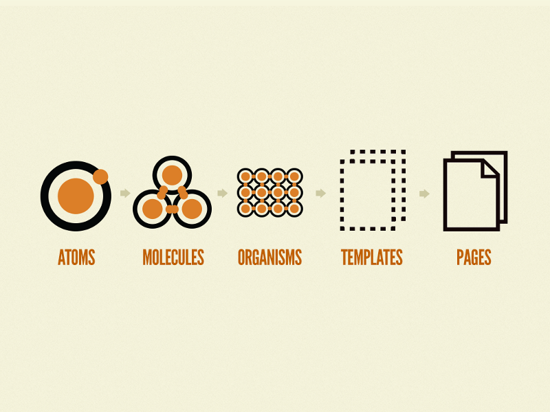
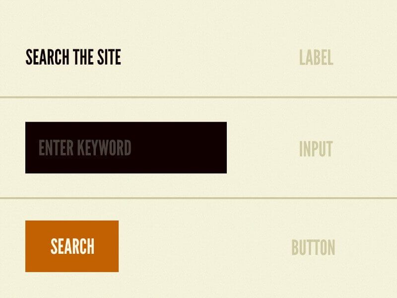
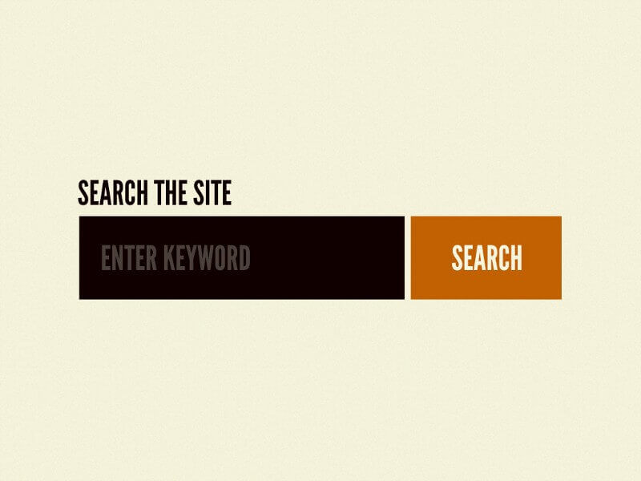
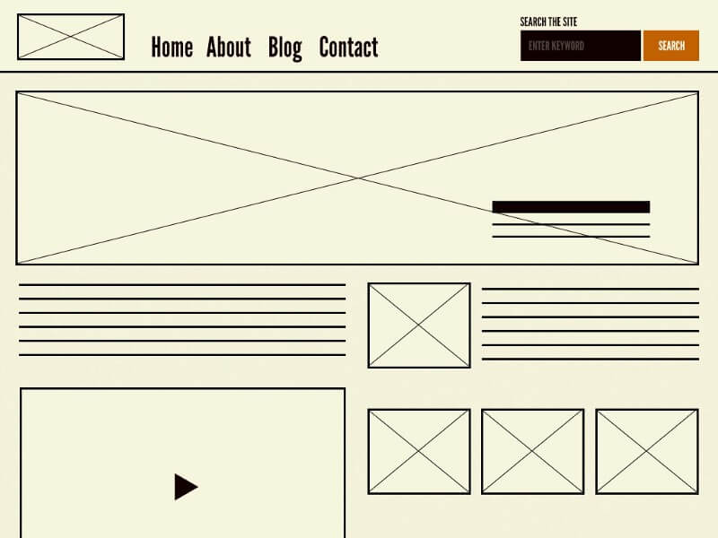
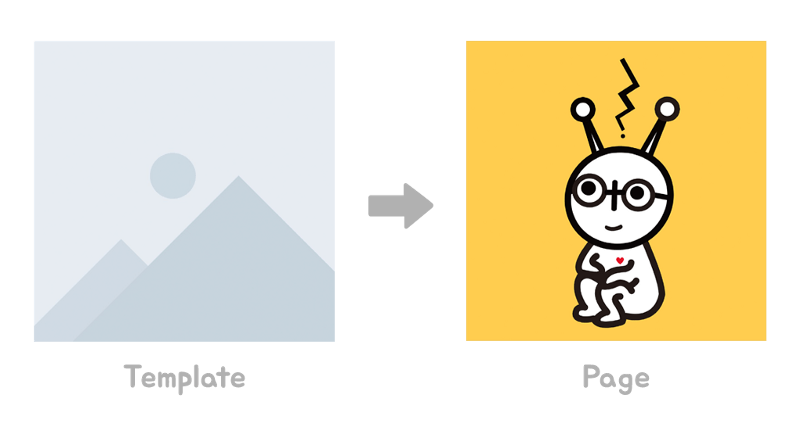
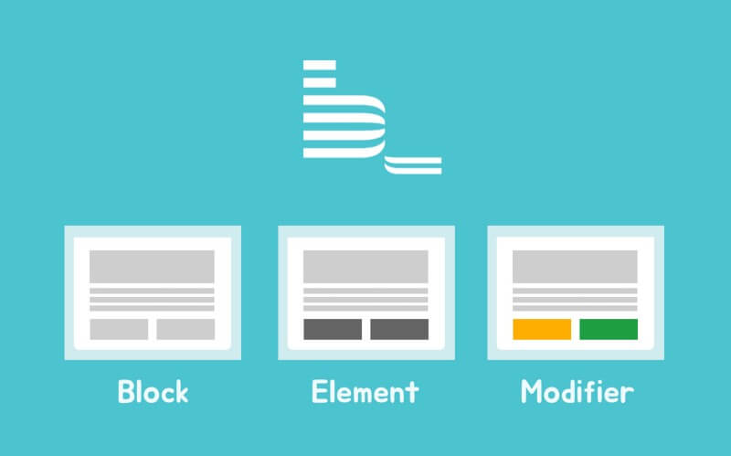

우리의 몸은 신비스러운 생명력과 놀랍고도 잘 정리된 조직체를 가지고 있다. 원자와 분자들의 매우 구조적인 조직들과 복잡한 유기체들이 공존한다.

소프트웨어 개발에서도 위와 같이 구조적인 설계와 잘 정리된 시스템이 중요하다. 이를 위해 도움될만한 2가지 방법론을 소개한다. 바로 아토믹 디자인(Atomic design)과 벰(BEM, Block Element Modifier)이다.

아토믹 디자인은 일관되고 재사용 가능한 디자인 설계 시스템을 구축하는 방법론이다. 웹 사이트 레이아웃을 기본 구성 요소로 분해한 다음, 사이트 전체에서 재사용 가능하게 만든다.

벰은 규칙적인 이름 짓기(네이밍)를 도와준다. 벰을 사용하면 클래스명(className)만으로도 해당 요소가 어떤 일을 하는지, 어디서 사용되는지, 어떤 관계를 가지고 있는지 쉽게 확인 가능하다.

### 초기 문제점

나는 새로운 프로젝트에서 리액트(React JS)로 웹 애플리케이션을 개발하게 되었다. 처음은 늘 설레는 법이지만, 다양한 문제로 개발 속도가 느리고 답답한 마음만 쌓여갔다. 그 원인에 대해 나름대로 분석하고 정리해보았다.

#### 동일하거나 비슷한 요소에 대한 문제

*   **많은 소요 시간 필요:** 동일한 요소를 다양한 페이지에서 각각 작업한다고 생각하면, 페이지 수만큼 개발 기간은 늘어나고 시간이 비효율적으로 사용된다.
*   **변경 용이의 어려움:** 만일 여러 페이지에 동일한 디자인으로 된 버튼들의 배경색을 바꾼다고 생각하자. 우선 페이지를 찾아야 하고, 해당 페이지에서 버튼을 찾아야 한다. 변경해야 하는 디자인이 많을수록 그에 따른 시간은 늘어난다.

#### 한 곳에 모든 것을 하려는 문제

*   **높은 위험성:** ‘과유불급 \[過猶不及\]’이라는 사자성어가 있다. 정도가 지나침은 미치지 못한 것과 같다는 뜻인데, 쉽게 이야기하면 너무 과하게 하지 말라는 것이다. 한 소스 코드 파일에 지나친 기능을 구현한다면 혼란을 야기하고 예상하지 못한 오류가 발생할 확률이 높다.
*   **낮은 가독성:** 기억의 토대는 기록이고, 기록은 어떻게 기억할지의 문제를 결정한다. 어떻게 디자인을 하고 개발을 하는지에 따라 개발과 오류를 해결할 때 발생하는 ‘탐색 비용’이 결정된다. 특정 기능을 개발하거나 오류를 해결할 때는 어떤 코드를 추가해야 하고 수정해야 하는지 빠르게 알아야 한다. 만일 한 파일 안에서 모든 요소들을 구현했다면, 코드를 삽입해야 하는 위치나 오류의 원인을 빠르게 찾기 힘들다.
*   **어려운 이름 짓기(네이밍):** 개발자가 가장 힘들어하는 일은 무엇일까? 여러 설문 조사에서 발표된 자료에 따르면, 부동의 1위를 하고 있는 것이 ‘이름 짓기’이다. 개발자는 개발을 하면서 디렉토리명, 파일명, 클래스명, 메소드명, 변수명 등 다양하게 이름을 짓는다. 그래서 한 소스 코드 파일 안에서 다양한 기능들이 추가될수록 이름 짓는 것은 더욱 복잡해지고 개발자에게 스트레스를 준다. 소스코드를 작성한 사람도 자신의 코드를 파악하기가 어려운 아이러니한 일이 발생한다.

위에 적힌 문제들이 바로 나의 문제들이었다. 조치와 개선이 필요했고.. 회사 동료의 조언과 인터넷 서칭을 통해 ‘ABEM’을 발견했다. 산삼을 발견하면 ‘심봤다!’라고 외치는데, 나는 다르게 외쳤다. “아~뺌!!!”

### 시스템적인 디자인

> **“인간은 도구를 만들고, 도구는 인간을 만든다.”**  
> (We Shape our tools, and then our tools shape us)   
> — Father John Culkin

‘ABEM’을 이야기 하기 전에, 시스템적인 디자인에 대해 알아보자. 서비스를 디자인한다는 것은 미적 요소뿐 아니라 디자인 패턴과 일관성 모두가 고려되어야 한다. 이 두 가지를 기초로 하여 디자인과 개발이 되어야 한다.

*   **디자인 패턴:** ‘디자인 패턴’은 소프트웨어 개발에서 사용되는 용어로, 반복적으로 사용되는 객체들의 상호작용을 패턴화하고 이를 문서화하기 위해 고안된 형식 방법이다. 사용자 인터페이스(User Interface)가 중요시되는 프로젝트라면 디자인도 ‘디자인 패턴’이 필요하다. 단일의 페이지만 멋지게 디자인하는 것이 아이라, 전체 페이지에서 사용된 디자인 이론과 패턴 등을 기록하고 공유하는 것이 중요하다.
*   **일관성:** 디자인은 일관성이 있어야 한다. 한 사이트 내에 버튼, 입력 폼 등 요소들의 일관성이 없으면, 사용자는 사이트를 한 번에 파악하기 어렵고 불편을 느낄 것이다. 만일 사이트에서 버튼들의 배경색이 초록색이었는데, 갑자기 특정한 버튼만 보라색으로 나오거나 다른 디자인으로 되어있다면 사용자는 어색함을 느낄 것이다. 일관된 디자인을 위해 노력해야 하는 사람은 디자이너뿐 아니라 실제로 구현해야 하는 개발자도 마찬가지이다.

### [Atomic design](http://bradfrost.com/blog/post/atomic-web-design/)


Atomic Design

아토믹 디자인은 디자인 시스템을 만드는 하나의 방법론이다. 이 디자인 시스템을 통해 더 높은 품질의 일관성 있는 사용자 인터페이스를 신속하게 구현하고 관리할 수 있다. 아토믹 디자인은 총 5개의 단계가 있으며, 이 단계가 서로 연결되어 사이트를 완성한다.

*   원자 (Atoms)
*   분자 (Molecules)
*   유기체 (Organisms)
*   탬플릿 (Templates)
*   페이지 (Pages)

#### **1\. 원자 (Atoms)**



원자는 물질의 기본 구성요소이다. 웹 인터페이스에서 적용되는 원자는 텍스트, 입력 폼 또는 버튼과 같은 HTML 태그다.

#### 2\. 분자 (Molecules)



분자는 원자들로 구성된 집합이다. 분자는 자신의 특성을 가지고 디자인 시스템의 중추 역할을 한다.

예를 들어, 텍스트, 입력 폼, 버튼은 그 원자 자체로는 유용하지 않지만, 분자라는 형태로 함께 결합되어 유용한 기능을 하게 된다.

#### 3\. 유기체 (Organisms)


유기체는 원자들과 분자들로 구성된 집합니다. 유기체는 뚜렷한 인터페이스를 형성한다.

사용자는 디자인 시스템에서 원자나 분자에 크게 관심이 없겠지만, 유기체부터 최종 인터페이스가 형성되기 시작하는 것에 많은 관심이 있을 것이다.

원자에서 분자, 유기체에 이르기까지 모든 것을 구성하면, 독립적이며 가독성이 있는 재사용 가능한 구성 요소를 만들 수 있다.

#### 4\. 탬플릿 (Templates)




템플릿에서는 데이터를 연결하기 이전의 레이아웃을 생성한다. 템플릿은 원자, 분자, 유기체 모두가 하나로 합쳐진 것이며, 우리는 레이아웃이 실제로 어떻게 보이는지 확인할 수 있다.

탬플릿을 통해 반복적인 작업을 자동화하고 프로젝트나 고객의 요구에 따라 템플릿을 유용하게 사용할 수 있다. 파워 포인트나 영상 탬플릿처럼 이미 만들어진 형식이라고 생각하면 된다. 이제 사용자는 다음 단계에서 데이터만 넣으면 된다.

#### 5\. 페이지 (Pages)


페이지는 템플릿의 특정 인스턴스이다.

탬플릿이 붕어빵 틀이라고 하면 페이지는 붕어빵이라고 생각하면 된다. 탬플릿로 구성된 레이아웃에 데이터를 삽입하여 페이지가 만들어진다.

*   탬플릿 — 붕어빵 틀
*   데이터 — 붕어빵 재료
*   페이지 — 붕어빵



만일 이미지가 탬플릿에서 플레스 홀더 콘텐츠로 보였다면, 페이지에서는 실제 콘텐츠로 대체된다. 페이지 단계에서는 사용자가 디자인을 정확하고 구체적으로 볼 수 있게 구현하는 것이다.

또한 이 단계는 우리가 설계 시스템의 효율성을 테스트하는 곳이다. 우리가 만든 분자, 유기체, 그리고 템플릿을 다시 수정하여 원하는 디자인으로 완성한다. 예를 들어 40자를 포함하는 헤드라인 글자가 340자의 글자가 되면 어떻게 보일까? 사용자가 온라인 장바구니에 하나의 상품을 담은 것과 할인 코드가 적용된 10개 상품을 담은 경우를 비교하여 어떻게 보일까? 등 이러한 질문들은 디자인 시스템이 어떻게 구성되어 있고 어떤 부분이 수정되어야 하는지, 또 변경후에도 어떤 부분이 부족한지 물어보고 수정하는 단계이다.

#### 아토믹 디자인의 장점

지금까지 아토믹 디자인의 5단계를 세부적으로 확인했다. 이 단계들로 디자인하고 개발하면 아래와 같은 이점들이 있다.

*   구성 요소를 혼합하여 일관성 있는 디자인을 만들 수 있다.
*   스타일 가이드를 간단하게 만들 수 있다.
*   레이아웃을 이해하기 쉬워진다.
*   보다 일관성 있는 코드를 작성할 수 있다.
*   신속한 프로토 타이핑을 할 수 있다.
*   디자인을 쉽게 추가, 수정, 제거할 수 있다.

#### 아토믹 디자인을 적용하기 위해 필요한 점

*   **이해와 노력:** 프로젝트에 참여하는 모두는 아토믹 디자인을 올바르게 알아야 한다. 만일 아토믹 디자인에 대해 개발자만 이해하고 적용한다면, 개발자는 페이지 단위의 디자인을 요소까지 어떻게 만들지 끊임없이 고민하고 생각해야 한다. 자연스럽게 기술 부채와 개발 기간은 늘어나고 디자인 시스템의 일관성은 떨어질 것이다. 그럼으로 기획과 디자인부터 개발까지 모든 구성원이 디자인 시스템을 적용하기 위한 이해와 노력이 필요하다.
*   **인내와 시간:** 아토믹 디자인을 적용하다 보면 원자와 분자를 만들지 않고 바로 유기체를 만들고 싶은 충동이 생긴다. 그럴 때는 고민하지 말고 원자, 분자를 만드는 일에 집중하고 그에 따른 시간을 아까워하지 않아야 한다. 원자와 분자 없이 바로 유기체에서 다 구현하려고 한다면, 디자인이 변경될 일이 생길 때 결과적으로 더 많은 시간과 노력이 필요하다. 디자인 시스템에 익숙해지고 구현에 있어서 습관화되도록 노력한다면, 디자인 시스템을 사용하기 이전보다 더 빠르고 구조적인 개발이 가능하다.

#### 아토믹 디자인을 위한 도구

[스케치(Sketch)](https://www.sketchapp.com/)와 [제플린(Zeplin)](https://zeplin.io/) 프로그램을 이용하면 쉽게 디자인 요소들을 컴포넌트화하고 공유할 수 있다. [제플린](https://zeplin.io/)의 [컴포넌트 기능(Components)](https://www.youtube.com/watch?v=cbWbuin54y4)을 사용하면 특정 버튼이 어느 페이지들에서 사용되고 있는지 쉽게 확인할 수 있고 페이지에서도 어떤 요소들로 구성되어 있는지 확인할 수 있다. 디자니와 개발자는 제플린을 통해 빠르고 효율적인 개발과 원활한 협업이 가능하다.

### [BEM (Block Element Modifier)](http://getbem.com/)



BEM 은 [Yandex](https://yandex.com/)라는 회사에서 개발한 방법론으로, 사내에서 프로젝트를 진행하다가 Naming Convention과 File Structure 문제를 겪게 되어 방법론을 개발했다고 한다.

#### BEM 미리 보기

```
B: .block {}E: .block__element {}M: .block--modifier {}
```

위와 같은 방법으로 이름을 짓는다.

#### B, Block(블록)

블록은 하나의 의미만을 가지는 독립적인 단위이다. 블록 네이밍은 ‘낙타 등 표기법(camelCase)’을 사용하지 않고, 붙임표(-, hyphens)을 사용한다. 예를 들어 메인 페이지(main page)의 클래스명을 네이밍 한다고 하면, ‘.mainPage’가 아니라 `.main-page`로 작성하면 된다.

#### E, Elements(요소)

요소는 블록의 일부이며 독립 실행적인 의미가 없다. 모든 요소는 그 블록에 묶여 있다. 요소 네이밍은 블록 이름과 두 개의 밑줄(\_, underscore) 및 요소 이름으로 구성된다. 예를 들어 메인 페이지 안에 사이드바가 있다고 하면, 해당 사이드바 클래스명을 ‘.mainPagesidebar’가 아니라 `.main-page__side-bar`라고 하면 된다.

#### M, Modifier(수정)

‘수정’은 블록 또는 요소에 플래그를 지정한다. 외모, 행동 또는 상태를 바꿀 때 사용한다. ‘수정’ 네이밍은 블록 또는 요소의 이름과 두 개의 붙임표(-, hyphens)로 구성된다. 예를 들어 메인 페이지 안에 사이가 노란색(yellow)인 것도 있고 초록색(green)인 것도 있다고 하면, 해당 사이드바들의 클래스명을 `.main-page__side-bar--yellow`, `.main-page__side-bar--green` 로 하면 된다.

#### BEM의 장점

*   클래스 이름을 통해 어떤 일을 하는지 알 수 있다.
*   클래스 이름을 통해 어디서 사용되는지 알 수 있다.
*   클래스 이름을 통해 다른 블록과 관계를 알 수 있다.

### ABEM

나는 이번 프로젝트에서 아토믹 디자인과 벰을 이용해 디자인 시스템을 구축하고 폴더와 소스 코드 구조를 체계적으로 세워나갔다. 그 결과 위에 적었던 문제들이 아래처럼 자연스럽게 해결되고 일정에 맞게 프로젝트를 잘 끝낼 수 있었다.

*   반복적인 작업이 줄어들어, 개발 기간을 축소하고 시간을 효율적으로 사용한다.
*   디자인 또는 기능 변경이 있을 경우, 변경이 용이하다.
*   오류가 발생할 경우, 어느 곳에서 에러가 발생했는지 쉽게 확인이 가능해 빠른 대처가 가능하다.
*   이름 짓기(네이밍)에 대한 스트레스가 덜하다.

어떻게 효율적으로 개발할 수 있을까? 심도있는 고민과 발전을 위한 노력은 코드를 생명력있게 만들고 개발자를 성장하게 만든다. 이 글을 읽고 있는 여러분도 “아~뺌!"을 외치며, 디자인 방법론과 네이밍 규칙을 프로젝트에서 이용해보는 건 어떨까?

### 추천 및 참고한 사이트

#### Atomic design

*   [공식 문서](http://bradfrost.com/blog/post/atomic-web-design/)
*   [소개 동영상](https://www.youtube.com/watch?v=q5CB1za0NfA)
*   [THE UNICORN WORKFLOW: DESIGN TO CODE WITH ATOMIC DESIGN AND SKETCH](https://www.invisionapp.com/blog/atomic-design-principles/)

#### BEM

*   [공식 문서](http://getbem.com/)
*   [디버깅 시간을 절약 할 수있는 CSS 명명 규칙](https://www.vobour.com/-css-%EB%94%94%EB%B2%84%EA%B9%85-%EC%8B%9C%EA%B0%84%EC%9D%84-%EC%A0%88%EC%95%BD-%ED%95%A0-%EC%88%98%EC%9E%88%EB%8A%94-css-%EB%AA%85%EB%AA%85-%EA%B7%9C%EC%B9%99)
