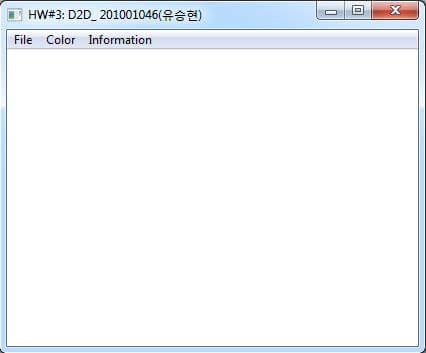
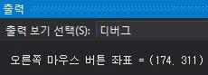
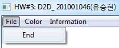
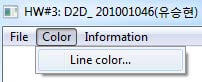
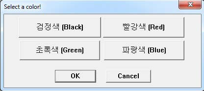
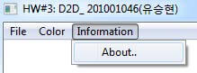
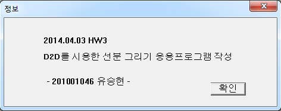
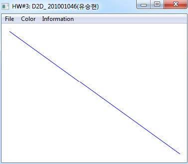
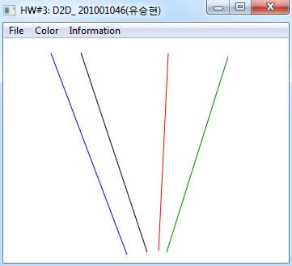

## 1. 처음 실행한 모습



소스를 실행한 처음 모습이다. 창에 프로그램 이름을 확인 할 수 있고 축소, 확대, 끄기 버튼이 생성되어 있다.

```C
// 초기화 함수
// 윈도우 application 생성
HRESULT Draw::Initialize(HINSTANCE hInstance) {
    HRESULT hr;
    // D2D 장치 비의존적(독립적) 자원을 생성, 초기화
    hr = CreateDeviceIndependentResources();
    if (SUCCEEDED(hr)) {
      WNDCLASSEX wcex = {
        sizeof(WNDCLASSEX)
      };
      wcex.style = CS_HREDRAW | CS_VREDRAW;
      wcex.lpfnWndProc = Draw::WndProc;
      wcex.cbClsExtra = 0;
      wcex.cbWndExtra = sizeof(LONG_PTR);
      wcex.hInstance = hInstance;
      wcex.hbrBackground = NULL;
      wcex.lpszMenuName = MAKEINTRESOURCE(IDC_WINAPP);
      wcex.hCursor = LoadCursor(NULL, IDI_APPLICATION);
      wcex.lpszClassName = L "D2DDraw";
      RegisterClassEx( & wcex); // 윈도우 클래스를 등록함
      // Create the window
      hwnd = CreateWindow(
        L "D2DDraw", L "HW#3: D2D_ 201001046(유승현)",
        WS_OVERLAPPEDWINDOW, CW_USEDEFAULT,
        CW_USEDEFAULT,
        640, 480, NULL, NULL, hInstance, this
      );
      hr = hwnd ? S_OK : E_FAIL;
      if (SUCCEEDED(hr)) {
        ShowWindow(hwnd, SW_SHOWNORMAL);
        UpdateWindow(hwnd);
      }
    }
    return hr;
```
초기화 함수에 해당하는 소스이다. 사실 완벽하게 이해가 안되지만, D2D 자원들을 초기화 해주고 창을 띄어주는 기능을 한다.



```C
// 현재 마우스 클릭한 위치의 X를 currentX, Y를 currentY 변수에 저장
double currentX = LOWORD(lParam);
double currentY = HIWORD(lParam);
// 오른쪽 마우스 클릭 좌표 표시
// 좌표 출력은 디버깅 모드에서 가능
TRACE(_T("\n오른쪽 마우스 버튼 좌표 = (%d, %d)\n"),
  (int) currentX, (int) currentY);
```

처음 실행한 상태에서 오른쪽 버튼을 클릭하게 되면, WM_RBUTTODWN이 적용이 된다. 선분이 하나도 없을 경우 단순히 현재 좌표만을 알려준다.

## 2. 메뉴

총 3개의 메뉴가 있다.



첫 번째로 ‘File’에 관한 것이다. File-End를 누르게 되면 프로그램이 종료된다.





두 번째로 ‘Color’인데, 선의 색상을 변경할 수 있다. Color-Line color...를 누르게 되면 바로 위 오른쪽 그림처럼 색을 선택할 수 있도록 창이 뜨게 된다. 선을 선택 후 OK를 누르면 색이 적용되고, Cancel를 누르면 취소하고 창이 꺼지게 된다.





마지막으로 ‘Information’의 About..을 누르게 되면 프로그램에 대한 정보를 볼 수 있다.

## 3. 색 변경





색을 바꾸기 전, 기본 색상은 파랑색이다. 위에 설명했던 메뉴 ‘Color’를 통해 선의 색을 바꿀 수 있다. 색의 종류는 파랑, 검정, 빨강, 초록색이다.

```C
// 색깔 선택창
INT_PTR CALLBACK ColorProc(HWND hDlg, UINT message, WPARAM wParam, LPARAM lParam) {
  //색상 대화 상자의 메시지 처리기
  UNREFERENCED_PARAMETER(lParam);
  switch (message) {
  case WM_INITDIALOG:
    return (INT_PTR) TRUE;
  case WM_COMMAND:
    if (LOWORD(wParam) == IDC_BLACK) {
      selectedColor = 1; //Black
      return (INT_PTR) TRUE;
    } else if (LOWORD(wParam) == IDC_RED) {
      selectedColor = 2; //Red
      return (INT_PTR) TRUE;
    } else if (LOWORD(wParam) == IDC_GREEN) {
      selectedColor = 3; //Green
      return (INT_PTR) TRUE;
    } else if (LOWORD(wParam) == IDC_BLUE) {
      selectedColor = 4; //Blue
      return (INT_PTR) TRUE;
    } else if (LOWORD(wParam) == IDOK) {
      //현재 컬러를 갱신함
      currentLine.color = selectedColor;
      EndDialog(hDlg, LOWORD(wParam));
      return (INT_PTR) TRUE;
    } else if (LOWORD(wParam) == IDCANCEL) {
      //취소
      EndDialog(hDlg, LOWORD(wParam));
      return (INT_PTR) TRUE;
    }
    break;
  }
  return (INT_PTR) FALSE;
}
```

색깔 선택 창에 대한 소스이다. 각 메뉴마다 선택된 IDC를 통해 색을 변경하여 확인을 누르거나 취소를 하여 창을 제어할 수 있다. 색은 전역변수 selectedColor에 저장된다.