GDI를 사용한 Win32 응용프로그램 작성 - 선분 그리기 응용 프로그램


## 1. 처음 실행한 모습
처음 실행한 상태에서 오른쪽 버튼을 클릭하게 되면, `WndProc` 함수에서 WM_RBUTTODWN이 적용이 되고 현재 좌표를 알려준다.

```C
LRESULT CALLBACK WndProc(HWND hWnd, UINT message, WPARAM wParam, LPARAM
lParam)
{
  switch (message)
    {
      case WM_RBUTTONDOWN:
        double currentX = LOWORD(lParam);
        double currentY = HIWORD(lParam);
        TRACE(_T("\n오른쪽 마우스 버튼 좌표 = (%d, %d)\n"), (int)currentX, (int)currentY);
```


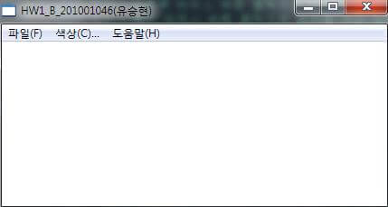
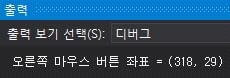

## 2. 메뉴 설명
메뉴는 총 3개의 메뉴가 있다.
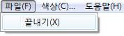

파일에서 끝내기를 누르게 되면 현재 돌아가고 있는 프로그램이 종료가 되고 창이 꺼진다.

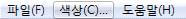


색상 메뉴를 클릭하게 되면 색을 골를 수 있는 버튼들이 있는 창이 따로 뜨게 된다. 원하는 색을 클릭하고 선택을 누르게 되면 선의 색이 변경이 가능하다. 취소를 누를 경우 색은 변경하지 않고 따로 뜬 색상 고르는 창이 꺼지게 된다.

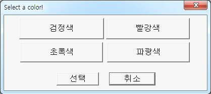

다양한 색상으로 선을 그릴 수 있다.

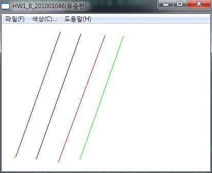


아래 소스는 색상 메뉴를 클릭했을 때 나오는 창에 대한 소스이다.

```C
INT_PTR CALLBACK ColorProc(HWND hDlg, UINT message, WPARAM wParam,
  LPARAM lParam) { //색상 대화 상자의 메시지 처리기
  UNREFERENCED_PARAMETER(lParam);
  switch (message) {
  case WM_INITDIALOG:
    return (INT_PTR) TRUE;
  case WM_COMMAND:
    if (LOWORD(wParam) == IDC_BLACK) {
      selectedColor = 0x000000; // black
      return (INT_PTR) TRUE;
    } else if (LOWORD(wParam) == IDC_RED) {
      selectedColor = 0x0000ff; // red
      return (INT_PTR) TRUE;
    } else if (LOWORD(wParam) == IDC_GREEN) {
      selectedColor = 0x00ff00; // green
      return (INT_PTR) TRUE;
    } else if (LOWORD(wParam) == IDC_BLUE) {
      selectedColor = 0xff0000; // blue
      return (INT_PTR) TRUE;
    } else if (LOWORD(wParam) == IDOK) {
      // 현재 컬러를 갱신
      currentColor = selectedColor;
      EndDialog(hDlg, LOWORD(wParam));
      return (INT_PTR) TRUE;
    } else if (LOWORD(wParam) == IDCANCEL) {
      // 취소
      EndDialog(hDlg, LOWORD(wParam));
      return (INT_PTR) TRUE;
    }
    break;
  }
  return (INT_PTR) FALSE;
}
```

메뉴의 마지막으로 도움말의 정보를 누르게 되면 프로그램에 관한 정보를 볼 수 있다.


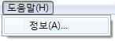

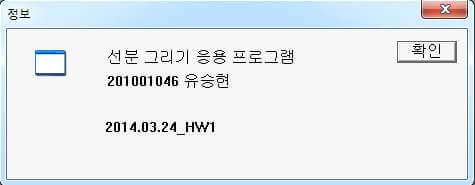

## 3. 기본 선의 색은 파랑색

기본으로 생성되는 선은 색은 파랑색이다. 아래 `currentColor` 변수를 전역 변수로 사용하여 현재 사용되는 선의 색을 저장한다.

```C
// 현재 사용되고 있는 컬러 (현재 파란색으로 처음 시작)
COLORREF currentColor = 0xff0000
```

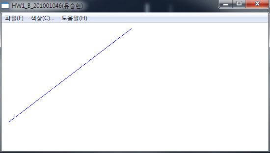

## 4. 선은 10개까지만 그릴 수 있다.

선은 최대 10개까지만 그릴 수 있다. 사용자가 왼쪽 마우스 클릭하였을 때 (WM_LBUTTONDOWN), Vectoer lines의 크기를 체크해서 10개 이상이 되었으면 오류의 창을 알려준다. 그렇지 않을 경우에는 선분의 p0, p1의 x값에 현재 마우스 클릭한 좌표의 x를 넣어주고, 선분의 p0, p1의 y값에는 현재 마우스 클릭한 좌표의 y를 넣어준다. 그리고 inputting를 true로 변경하여 마우스의 움직임을 통하여 선분을 그을 수 있도록 지정해준다. 사용자가 마우스를 땔 경우에 선분의 모든 좌표가 올바르게 적용된다.

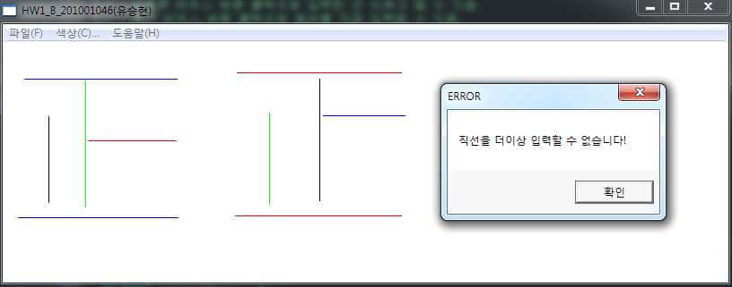

```C
LRESULT CALLBACK WndProc(HWND hWnd, UINT message, WPARAM wParam,
    LPARAM lParam) {
    switch (message) {
    case WM_LBUTTONDOWN:
      {
        if (lines.size() >= 10) {
          ::MessageBox(hWnd, _T("직선을 더이상 입력할 수 없습니다!"), _T("ERROR"),
            MB_OK);
        } else {
          currentLine.p0.x = currentLine.p1.x = LOWORD(lParam);
          currentLine.p0.y = currentLine.p1.y = HIWORD(lParam);
          currentLine.color = currentColor;
          inputting = true;
        }
      }
      break;
```

## 5. 디버그 출력창을 통해 선들과의 거리 체크

오른쪽 마우스를 클릭할 경우, 현재 마우스 버튼의 좌표를 확인할 수 있다고 위에서 설명했다. 만일 선분이 있을 경우에는 선분들의 위치와 색상, 현재 위치와 선분들과의 거리를 모두 확인할 수 있다. 선분과의 거리는 `distance`라는 함수를 통해 구현하였다.

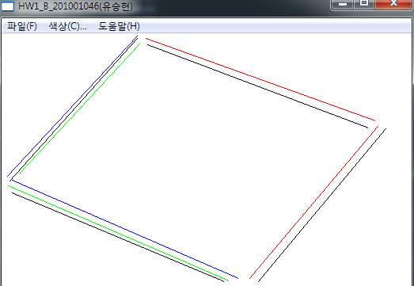

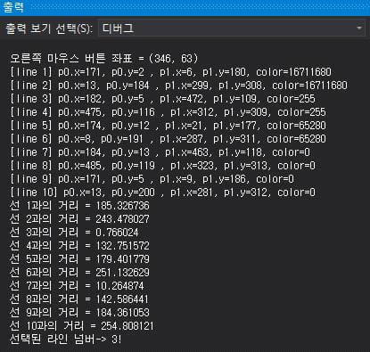

오른쪽 마우슥가 다운되었을 때 실행되는 소스이다. 오른족 마우스 클릭한 좌표와 선들과의 처리차 저장하는 배열 `distanceResult`, 현재 위치를 저장하는 지역 변수 `currentX`, `currentY`, 선분과의 거리와 우선순위를 통해 선을 선택하는 전역 변수 `lineSelect`, 현재 좌표와 선분들의 거리를 체크해주는 함수 `distance` 호출 등이 주로 이용된다.

```C
// 오른쪽 마우스가 다운되었을 때(DOWN)
case WM_RBUTTONDOWN: {
  float distanceResult[10] = {
    0.0
  }; // 오른쪽 마우스 클릭한 좌표와
  선들과의 거리차 저장하는 배열
  lineSelect = -1; // 선택한 라인 넘버 초기화
  double currentX = LOWORD(lParam); // 현재 마우스 클릭한
  위치의 X를 currentX 변수에 저장
  double currentY = HIWORD(lParam); // 현재 마우스 클릭한 위
  치의 Y를 currentY 변수에 저장
  // 오른쪽 마우스 클릭 좌표 표시
  TRACE(_T("\n오른쪽 마우스 버튼 좌표 = (%d, %d)\n"),
    (int) currentX, (int) currentY);
  // 라인이 하나도 없을 경우 break문을 통해 탈출
  if ((int) lines.size() <= 0) {
    break;
  }
  // 라인이 하나라도 있을 경우 드래그가 가능하도록 아래 else로
  들어감
  else {
    // 현재 Vector Lines에 있는 모든 p0, p1의 x, y 좌표 표시
    for (int i = 0; i < (int) lines.size(); i++) {
      TRACE(_T("[line %d] p0.x=%d, p0.y=%d , "), i + 1,
        lines[i].p0.x, lines[i].p0.y);
      TRACE(_T("p1.x=%d, p1.y=%d, color=%d \n"),
        lines[i].p1.x, lines[i].p1.y, lines[i].color);
    }

    // 오른쪽 마우스 클릭 좌표와 라인과의 거리 차이를 distance 함수를 이용해 배열 distanceResult에 저장
    for (int j = 0; j < (int) lines.size(); j++) {
      distanceResult[j] = distance(lines[j], currentX,
        currentY);
    }
    // distanceResult 배열 값들의 출력을 통해 모든 선들의 최소 거
    리 체크
    for (int k = 0; k < (int) lines.size(); k++) {
      TRACE(_T("선 %d과의 거리 = %f \n"), k + 1,
        distanceResult[k]);
    }
    // distanceResult 배열 값들 중에 거리 차이가 1이하인 선들을
    파악
    // 거리 차이가 1 이하인 선들 중에 가장 나중에 만들어진 선을 선
    택
    for (int l = 0; l < (int) lines.size(); l++) {
      if (distanceResult[l] >= -1 && distanceResult[l] <= 1) {
        lineSelect = l;
      }
    }
    // line이 하나라도 선택이 됬을 경우 bool형 lineMoving 변수를
    true로 변경하여 드래그 가능하도록 변경
    // lineMoving 변수는 WM_MOUSEMOVE에서 사용
    // TRACE 함수를 통해 마우스 오른쪽 버튼으로 선택된 선의 번호
    를 알림
    if (lineSelect >= 0) {
      lineMoving = true;
      TRACE(_T("선택된 라인 넘버-> %d!\n"), lineSelect + 1);
    }
    break;
  }
}
```

`distance` 함수는 오른쪽 마우스 클릭하게 될 때, 선분이 존재해있으면 현재 좌표와 선분들과의 거리를 구해준다. return은 double 실수형으로 출력해주기 때문에 다양한 곳에서 받아서 사용할 수 있다. `distance` 함수 이외에도 두 구조체의 변수들(x,y)를 통해 거리 계산하는 함수 `GetDistance`, 오른쪽 마우스 클릭했을 때 어디 위치를 기준으로 드래그 할 것인지를 분별하는 `GetDistance2`, 두 실수형의 크기를 비교하여 작은 값을 출력하는 `GetMin`, 두 실수형의 크기를 비교하여 큰 값을 출력하는 `GetMax` 함수 등 거리에 관련된 함수는 총 5개이다.

```C
// 오른쪽 마우스 클릭과 이미 그려진 선들과의 거리를 구하는 함수
double distance(Line lines, double currentX, double currentY) {
  POINT2 p; // 클릭한 오른쪽 마우스 좌표를 저장할 구조체 선언
  LINE2 l; // 이미 그려져 있는 라인(lines[.])을 잇는 선분
  POINT2 a; // p와 p1,p2를 지나는 직선과의 교점
  double m1; // 새롭게 생성될 l의 기울기
  double k1; // l의 방정식 y=mx+k1의 상수 k1
  double m2; // l과 수직인 직선의 기울기
  double k2; // l과 수직인 직선의 방정식 y=mx+k2의 상수 k2
  // 클릭한 오른쪽 마우스 좌표의 x,y를 구조체 p에 대입
  p.x = currentX;
  p.y = currentY;
  // line 구조체를 통해 p1, p2 구조체를 접근하여 기존에 존재한 라인들의 좌표를 대
  입
  l.p1.x = lines.p0.x;
  l.p1.y = lines.p0.y;
  l.p2.x = lines.p1.x;
  l.p2.y = lines.p1.y;
  // 선분이 수직일 경우
  if (l.p1.x == l.p2.x) {
    a.x = l.p1.x;
    a.y = p.y;
  }
  // 선분이 수평일 경우
  else if (l.p1.y == l.p2.y) {
    a.x = p.x;
    a.y = l.p1.y;
  }
  // 그 외의 경우
  else {
    // 기울기 m1
    m1 = (l.p1.y - l.p2.y) / (l.p1.x - l.p2.x);
    // 상수 k1
    k1 = ((-1 * m1) * l.p1.x) + l.p1.y;
    // 이제 선분 l 을 포함하는 직선의 방정식은 y = m1x + k1를 구함
    // 두 직선은 직교하기 때문에 m1 * m2 = -1
    // 기울기 m2
    m2 = -1.0 / m1;
    // p 를 지나기 때문에 yp = m2 * xp + k2 => k2 = yp - m2 * xp
    k2 = p.y - m2 * p.x;
    // 두 직선 y = m1x + k1, y = m2x + k2 의 교점을 구함
    a.x = (k2 - k1) / (m1 - m2);
    a.y = m1 * a.x + k1;
  }
  // 구한 점이 선분 위에 있는 지 확인
  if (a.x >= GetMin(l.p1.x, l.p2.x) && a.x <= GetMax(l.p1.x, l.p2.x) &&
    a.y >= GetMin(l.p1.y, l.p2.y) && a.y <= GetMax(l.p1.y, l.p2.y))
  // 구한 교점이 선분위에 있으면 p 와 a 와의 거리가 최소 거리
  {
    return GetDistance(p, a);
  }
  // 구한 교점이 선분 위에 없으면 p~p1 또는 p~p2 중 작은 값이 최소 거리
  else {
    return GetMin(GetDistance(p, l.p1), GetDistance(p, l.p2));
  }
}
// 두 구조체의 변수들(x,y)를 통해 거리 계산하는 함수
double GetDistance(POINT2 a, POINT2 b) {
  return sqrt((b.x - a.x) * (b.x - a.x) + (b.y - a.y) * (b.y - a.y));
}
// 오른쪽 마우스 클릭했을 때 어디 위치를 기준으로 드래그할 것인지를 분별하는 함수
double GetDistance2(POINT a, int bx, int by) {
  return sqrt((bx - a.x) * (bx - a.x) + (by - a.y) * (by - a.y));
}
// 두 실수형의 크기를 비교하여 작은 값을 출력
double GetMin(double d1, double d2) {
  if (d1 < d2)
    return d1;
  return d2;
}
// 두 실수형의 크기를 비교하여 큰 값을 출력
double GetMax(double d1, double d2) {
  if (d1 > d2)
    return d1;
  return d2;
}
```

## 6. 선의 드래그 기능
오른쪽 마우스가 다운되었을 경우 모든 선분들의 거리를 체크한다. 그 중에 선과의 거리가 픽셀 –1이상, +1이하이 되는 선분들의 우선순위(가장 최신에 생성된 선분)를 체크한 후에 최종적으로 하나의 선을 선택한다. 하나의 선의 번호가 결정이 되면 마우스 드래그가 가능하게 전역 변수 `lineMoving`가 true 로 변경이 되고 드래그가 가능하다.

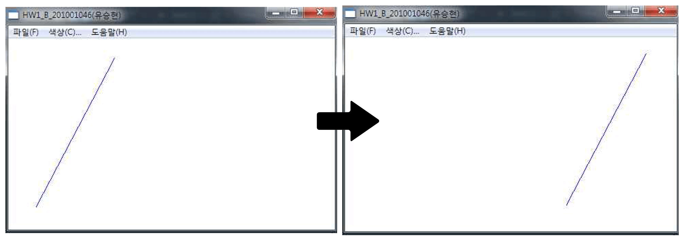

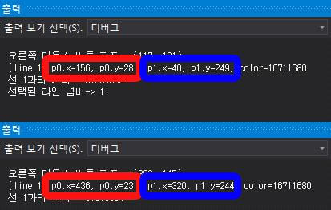


선분들의 거리를 비교하여 distanceResult[10]에 저장하고, 거리 차이가 1 이하인 선들 중에 가장 나중에 만들어진 선을 lineSelect 변수에 저장한다.

```C
for (int l = 0; l < (int) lines.size(); l++) {
  if (distanceResult[l] >= -1 && distanceResult[l] <= 1) {
    lineSelect = l;
  }
}
```

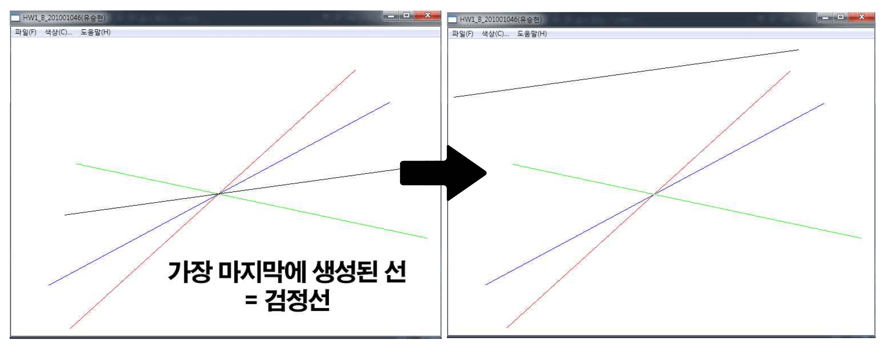

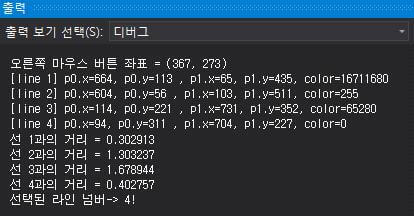

위 디버그 출력을 보게 되면, 현재 좌표와 line 1과 line 4의 거리가 픽셀 1 이하인 것을 확인할 수 있다. 그러나 line 4가 나중에 생성되었기 때문에 line 4번이 선택되었다. 결국 드래그를 시도할 경우 line4번만 움직이게 된다.

마우스가 움직일 때 작동되는 소스

```C
case WM_MOUSEMOVE: {
  // 마우스가 왼쪽 클릭된 상태에서 움직일 경우(선 그리기)
  if (inputting) {
    ...
  } // 잠시 생략
  // 마우스가 왼쪽 클릭된 상태에서 움직일 경우(선 드래그)
  else if (lineMoving) {
    // 실수형 intervalX, intervalY를 통해 선택된 라인의 X와 Y의 변경을 통해 드래그 효과를 만듬
    double intervalX = 0.0;
    double intervalY = 0.0;
    HDC hdc = ::GetDC(hWnd);::SetROP2(hdc, R2_NOTXORPEN);
    // 이전 라인을 지움
    drawLine(hdc, lines[lineSelect]);
    // 현재 클릭된 오른쪽 마우스와 line 구조체의 p0과 p1의 거리를 비교해 어디를 기준으로
    드래그 할 것인지 분별
    if (GetDistance2(lines[lineSelect].p0, LOWORD(lParam), HIWORD(lParam)) >=
      GetDistance2(lines[lineSelect].p1, LOWORD(lParam), HIWORD(lParam))) {
      intervalX = LOWORD(lParam) - lines[lineSelect].p1.x;
      intervalY = HIWORD(lParam) - lines[lineSelect].p1.y;
    } else {
      intervalX = LOWORD(lParam) - lines[lineSelect].p0.x;
      intervalY = HIWORD(lParam) - lines[lineSelect].p0.y;
    }
    // intervalX를 통해 p0과 p1의 x값을 동일하게 증감
    // intervalY를 통해 p0과 p1의 y값을 동일하게 증감
    lines[lineSelect].p0.x += intervalX;
    lines[lineSelect].p0.y += intervalY;
    lines[lineSelect].p1.x += intervalX;
    lines[lineSelect].p1.y += intervalY;
    // 이후 라인을 그림
    drawLine(hdc, lines[lineSelect]);::ReleaseDC(hWnd, hdc);
  }
  break;
}
```

위 소스를 보면 `GetDistance2` 함수를 이용해 현재 위치와 라인의 p0, p1의 거리를 비교하여서 어디를 눌러서 드래그 할 것인지를 분별하여 드래그하게 된다. 만일 p0의 위치가 현재 오른쪽 마우스 다운한 위치와 더 가깝다면 p0의 위치를 선택하여 선의 드래그가 시작되고, 반대로 p1의 위치가 더 가깝다면 p1의 위치를 선택하여 선의 드래그가 시작되고 마우스를 움직이면 된다. `GetDistance2` 함수를 이용하여 p0 또는 p1를 정하게 되면 그 것을 기분으로 현재 움직이는 마우스의 좌표의 X, Y 차이를 통해 line의 모든 변수를 이동시킨다.

## 6. 창의 변화
모든 선들은 전역으로 선언된 구조체 line, 벡터 lines를 사용하기 때문에 창의 변화가 있더라도 올바르게 잘 그려주고 드래그도 잘 된다.

```C
// 라인 구조체
typedef struct Line {
  POINT p0;
  POINT p1;
  COLORREF color; //0x00bbggrr
} Line;

// 입력된 모든 라인들을 가지는 벡터
std::vector < Line > lines;
```

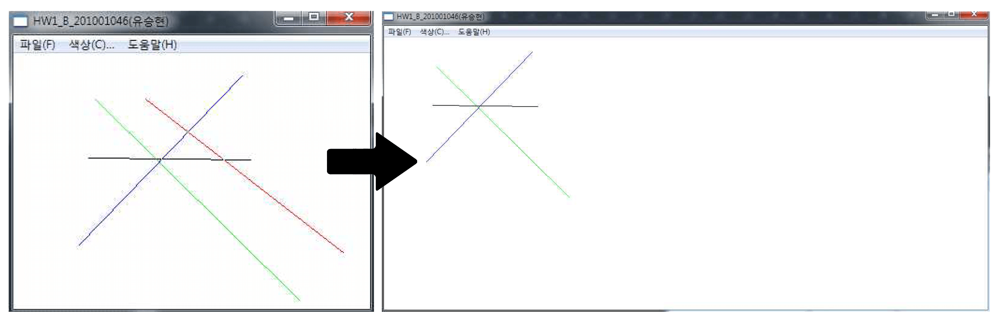

## 8. 과제 소감

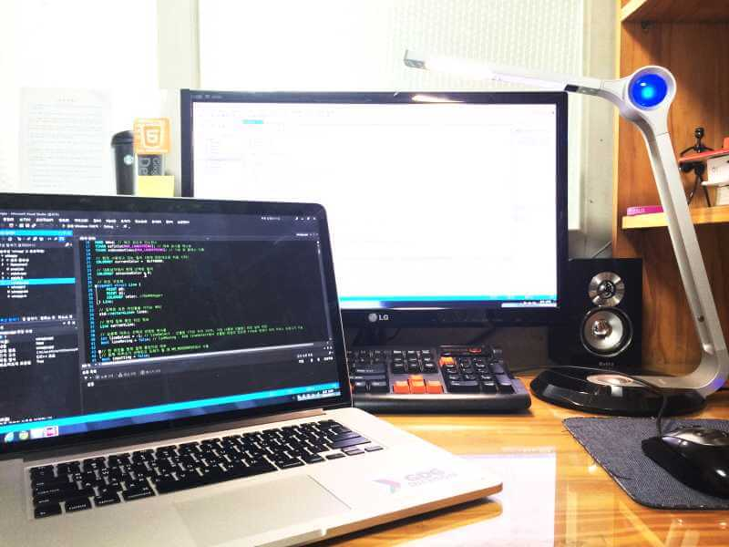

이번 과제를 통해서 GDI, Win32 API, Visual Studio의 확장자 등을 공부하게 되었다. 과제를 해보기 전에는 선 그리기, 움직임을 구현한다는 것이 쉽고 단순할거라고 생각했는데, 직접 구현하려고 하니 다양한 변수, 메소드, 함수들이 필요하다는 것을 느꼈다. 그리고 사용자가 생각하지 못한 방법으로 프로그램을 사용할 수 있기에 여러 상황들을 미리 예측해볼 수 있는 시간도 가질 수 있어서 프로그래밍 공부에도 도움이 되었다. 특히 TRACE 함수를 이용해 디버그 용도로 다양한 값들을 출력해보면서 내가 구현하고 있는 프로그램 변수의 값들과 진행 상황들을 볼 수 있어서 좋았다. TRACE 함수로 문자열을 출력하려고 했을 때 계속 오류가 나서 30분 동안 혹시 내가 코딩을 잘못했나 싶었는데, 문자열 앞에 ‘_T’를 표시하지 않아서였다. 이러한 작은 글자에도 프로그램은 예민하게 받아드리는 모습에 더 기계적인 관점에서 코딩하게 된 것 같다. 이 과제가 ‘게임 프로그래밍’ 수업의 첫 과제이지만 앞으로 진행될 수업과 과제가 더욱 기대가 되고 개발자로서 더 열정을 다해 개발해보고 싶다.


