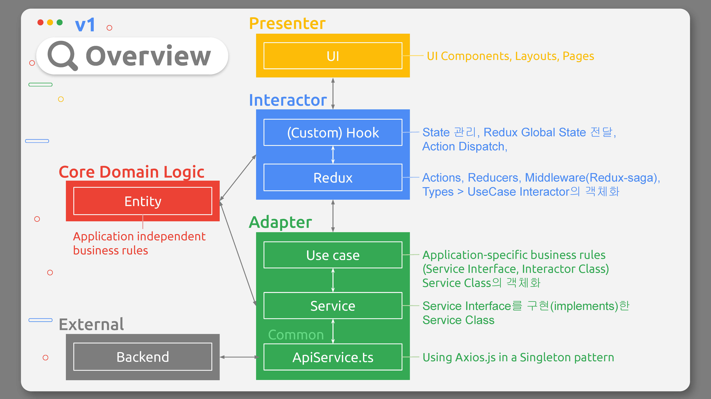

회사에서 리액트로 프론트엔드 웹 페이지를 만들며 구조 관련해서 고민해보고 정리해보았다.

## Presenter
Presenter는 사용하게 보여지는 부분을 담당하며, 주로 Layouts, Components, Pages, Styles, Assets 등을 포함한다.

## Interactor
Interactors는 기능을 수행하는 부분을 담당하며, 리액트에서는 Custom Hook, 전역 상태(Redux) 등을 포함한다.

## Adapter
Adapter는 외부와 통신하는 부분을 담당하며, 주로 Axios를 통한 백엔드 통신 부분을 포함한다.

## 아키텍처 v1

(글 작성중입니다)
